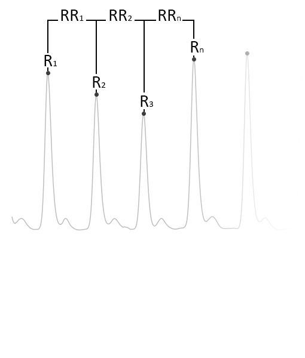
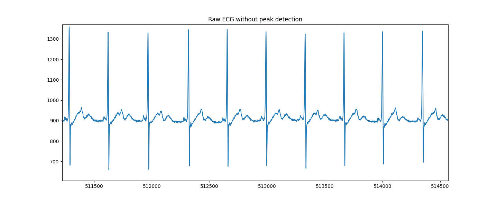
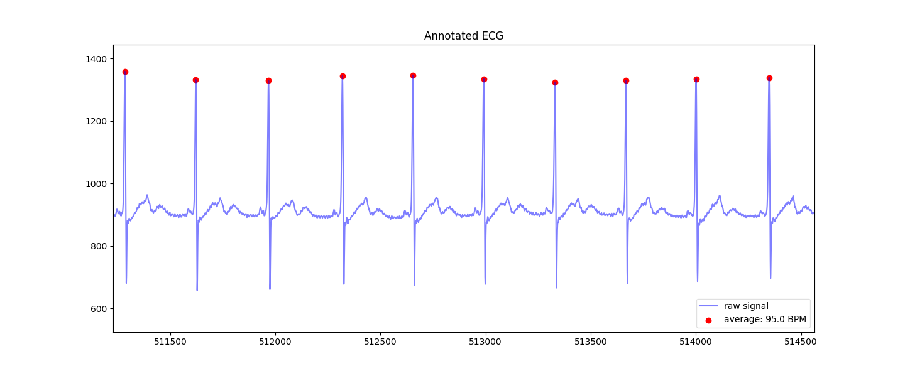
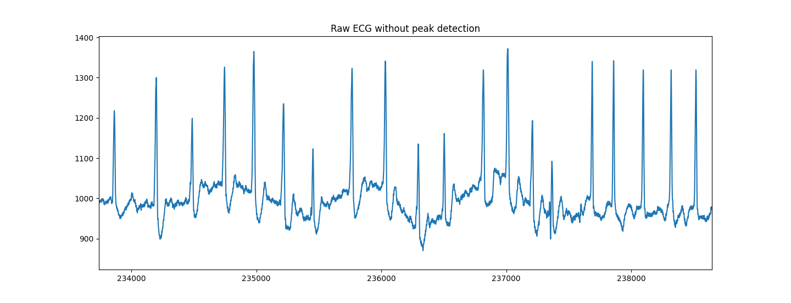
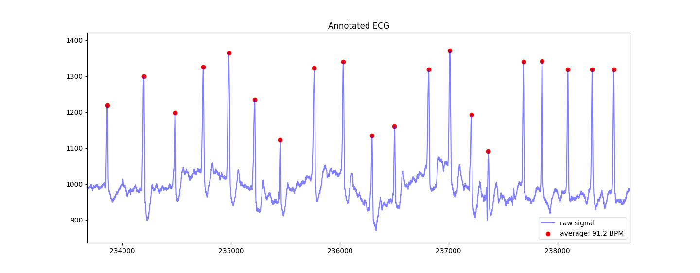
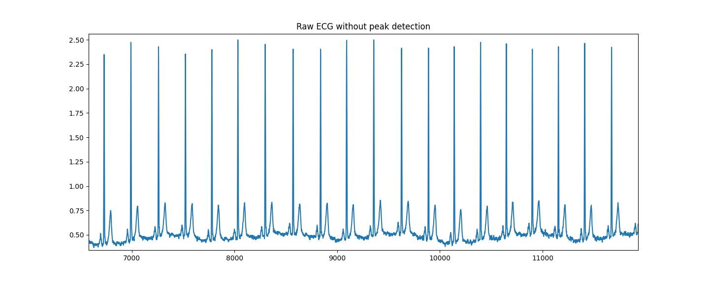

**_NOTE: TO SEE THE MOST CURRENT VERSION OF THIS DOCUMENT,
[CLICK HERE](./docs/FINAL-REPORT.pdf)_**

# Electrocardiogram Sonification: Senior Capstone Project

_author: Sebastian James_  
_06/02/2022_

## I. OVERVIEW

This report details the completion of my senior capstone project as described
in [SDD v1.0a](./docs/assets/SDD_v1.0a.pdf).

## II. PROGRESS SINCE [WINTER 2022 QUARTER REPORT](./docs/assets/WIN2022-REPORT.pdf)

**_Preamble from a note made after Winter 2022 Quarter Report:_**  
This project has reached a crossroads. Initially, I had proposed using
`C++` to build a biosignal sonification tool which utilized `ChucK` and
compiled down to an executable which may be employed on a microcomputer.
This was done with the interest in algorithm speed, versatility, and a
cross-platform approach in mind. However, due to the lack of adequete
libraries for processing and analysis of electrocardiogram data (ECG) in `C++`
and the ease of ECG processing, analysis, and annotation in `Python`,
this project will now need to move to a repository based off `Python`.
After sufficient development in `Python`, it will be possible to export
the sonification algorithm to `C++`, but `Python` will used for initial development.
In Winter 2022 Quarter Report I detailed a plan to
transition from the amplitude analysis program written to an algorithm incorporating heart rate variability (HRV), live data
acquisition, pulse oximetrey, and blood pressure readings. However, after
spending sufficient time on ECG HRV analysis, I decided to approach this project
with depth in heart data as opposed to breadth across numerous physiological parameters.
In addition to analyzing raw ECG data to calculate HRV and heart rate (HR), I will use probability and
statistics to add additional measures of heart health. Using information theory
and Shannon Entropy, I will calculate the information content of an observed HRV value
relative to a mean to measure how _surprising_ observed HRV values are.
Since the milestones summarized in Winter 2022 Quarter Report,
I have accomplished the following:

1. Development of ECG processing and analysis software using `Python`.
2. Development of an electrocardiogram (ECG) sonification algorithm utilizing
   heart rate, heart rate variability, statistics, and information theory to represent
   ECG data in a musical paradigm.

## III. METHODS

In this section, I will detail the methods used in the final iteration of my
senior capstone project.

### i. ECG Data Analysis in `Python`

The architecture of the ECG analysis pipeline in `Python` is as follows:

```txt
|--> Python 3
|----> heartpy: library to extract measures of HRV (RMSSD) and HR
|----> matplotlib: to plot ECG data and check HRV and HR analysis
|----> scipy: to calculate statistical distributions
|----> numpy: to randomly calculate the root note from a
			  probability mass function
|----> pythonosc: open sound control (OSC) library to implement
				  an OSC client in Python to communicate with ChucK
```

`ecg_hrv.py` handles ECG data analysis and communication with `ChucK`. ECG data is read from a `.csv` file containing
amplitudes over a designated sampling rate in Hz (samples per second). The `readECG()` function wraps a `heartpy`
function to extract amplitudes from a `.csv` file and imports them into an array which can then be further acted upon.
This raw data can be plotted to check for noise or artifacts before analyzing for HRV and HR. The ECG data is then
passed to `processBySegment()` which analyzes the raw ECG data for measures of HR and HRV. This is done by first
calculating the R peak – the maximum electrical voltage which appears in the QRS complex on an ECG and refers to
depolarization of the right and left ventricles of the heart and contraction of the large ventricular muscles (see [QRS Complex](https://en.wikipedia.org/wiki/QRS_complex)).

To identify heartbeats, a moving average is calculated using a window of 0.75 seconds on both sides of each data point.
The first and last 0.75 seconds of the signal are populated with the signal’s mean; no moving average is generated
for these sections. Regions of interest (ROI) are marked between two points of intersection where the signal
amplitude is larger than the moving average. This is much like the [_Pan-Tomkins Algorithm_](https://en.wikipedia.org/wiki/Pan%E2%80%93Tompkins_algorithm).

Once heartbeat peaks have been identified, HR, in beats per minute (bpm), can be calculated with the following equation

$$ HR(bpm) = \frac{60}{RR(s)} $$

where 60 seconds is divided by the time between two consecutive R-peaks ($RR$) in seconds.

HRV is calculated as a measure of the root mean square of successive differences (RMSSD) which is the square root of the
mean time between R-peaks ($RR_n$). RMSSD is calculated using the following equation

$$ RMSSD = \sqrt{\frac{1}{n - 2} \sum*{i=0}^{n - 2} (RR*{i} - RR\_{i + 1})^{2}} $$

where $n$ is the number of R-peaks used in analysis. HRV is an accepted and reliable means for assessing autonomic nervous system
dysfunction and the heart muscle's ability to change to meet physiological demand. Average HRV for infants is 153.1 ms and decreases
in age to an average of 17.9 ms after the age of 80 ([van den Berg et al. 2018](https://doi.org/10.3389/fphys.2018.00424))
A 5-minute measurement of HRV is considered methodologically adequate. [Nussinovitch et al. (2011)](https://doi.org/10.1111/j.1542-474X.2011.00417.x)
found that RMSSD seems to be a reliable parameter for assessing HRV from ultra-short (1 minute or 10 seconds) resting
electrocardiographic recordings. As such, I used a 10 second window as a processing length for `processBySegment()`.
Nussinovitch et al. found that the mean HRV over a 10 second window was $\mu = 38.70$ ms with a standard deviation of $SD = 33.27$ ms.
These values were used to approximate a normal distribution such that the probability of each observed HRV value could be calculated.



Lastly, the `Python` program calculated the [information content](<https://en.wikipedia.org/wiki/Entropy_(information_theory)>) of
each observed HRV value to apply a metric of how _surprising_ the resulting sonification should be. This value was calculated relative
to the PMF of the observed HRV value in respect to a normal distribution with mean $\mu$ and standard deviation $SD$. The equation for
the information content or _surprisal_ of an event $E$ is a function which increases as the probability $p(E)$ of an event decreases. It
is calculated with the following equation

$$ I(E) = \log*{2} \left( \frac{1}{P(HRV = X*{i})} \right) $$

and is left in terms of bits (the unit of measurement for $\log$ with a base of 2). The computed measures of HR, HRV,
root note (see _Compositional Algorithm_ below), CDF of HRV, and information content of the observed HRV were sent to `ChucK` over open sound control (OSC).

### ii. Sonification in ChucK

The architecture of the `ChucK` program is as follows:

```txt
|--> ChucK
|----> oscServ(): OSC server
|----> sonify(): ECG data sonification algorithm
|----> cal_HR_octave(): calculate octave of notes
	   to be played as a function of HR
|----> Synth [CLASS]: Synthesizer instrument class
|----> baseline(): construct a melody from random
				   chance as a baseline to compare the sonfication to
```

`ChucK` handled the sonification of the ECG measures using the compositional algorithm detailed below.

### iii. Compositional Algorithm

Detailed here is the algorithm I developed for ECG biosignal sonification using HRV, HR, and
Shannon Entropy.

```txt
Note, that values used for HRV or HR cutoffs of tiers are
arbitrarily chosen by preference and experience, but have
some relation to the $SD$ of each type of measure.

Python:
START
1. Calculate the RMSDD and HR of heart data in 10 second segments.
2. For each segment:
	3. Calculate the shannon entropy using the PMF of the observed
	HRV (mu = 38.7, SD = 33.27) and apply that value to the
	probability that a chord is played.
	4. Calculate the CDF of observed HRV (mu = 38.7, SD = 33.27)
	5. The root is determined by the conditions below:
```

`HRV Tiers (mu = 38.7, SD = 33.27)` [[source]](https://onlinelibrary.wiley.com/doi/epdf/10.1111/j.1542-474X.2011.00417.x)

```txt
		6. If the previous root is I (the default is I):
			7. The root is determined by the HRV PMF table below.
```

| HRV Range       |  I   |  ii  | iii  |  IV  |  V   |  vi  | vii  |
| :-------------- | :--: | :--: | :--: | :--: | :--: | :--: | :--: |
| <16.5           | 0.00 | 0.00 | 0.02 | 0.00 | 0.08 | 0.10 | 0.80 |
| <22.1 && >=16.5 | 0.10 | 0.10 | 0.05 | 0.05 | 0.30 | 0.10 | 0.30 |
| <27.6 && >=22.1 | 0.20 | 0.10 | 0.18 | 0.10 | 0.30 | 0.02 | 0.10 |
| <38.7 && >=27.6 | 0.15 | 0.14 | 0.14 | 0.14 | 0.15 | 0.14 | 0.14 |
| <49.8 && >=38.7 | 0.20 | 0.10 | 0.08 | 0.12 | 0.30 | 0.10 | 0.10 |
| <55.5 && >=49.8 | 0.40 | 0.10 | 0.00 | 0.10 | 0.08 | 0.30 | 0.02 |
| >=55.5          | 0.30 | 0.00 | 0.00 | 0.30 | 0.30 | 0.10 | 0.00 |

```txt
		8. If the previous root is ii, iii, IV, or vi:
			9. The root is determined by the HRV PMF table below.
```

| HRV Range       |  I   |  ii  | iii  |  IV  |  V   |  vi  | vii  |
| :-------------- | :--: | :--: | :--: | :--: | :--: | :--: | :--: |
| <16.5           | 0.00 | 0.20 | 0.30 | 0.08 | 0.02 | 0.10 | 0.30 |
| <22.1 && >=16.5 | 0.00 | 0.30 | 0.30 | 0.00 | 0.05 | 0.05 | 0.30 |
| <27.6 && >=22.1 | 0.10 | 0.30 | 0.08 | 0.05 | 0.12 | 0.05 | 0.30 |
| <38.7 && >=27.6 | 0.10 | 0.04 | 0.00 | 0.05 | 0.26 | 0.30 | 0.25 |
| <49.8 && >=38.7 | 0.10 | 0.16 | 0.04 | 0.15 | 0.30 | 0.15 | 0.10 |
| <55.5 && >=49.8 | 0.10 | 0.05 | 0.00 | 0.10 | 0.40 | 0.15 | 0.20 |
| >=55.5          | 0.00 | 0.10 | 0.00 | 0.00 | 0.60 | 0.00 | 0.30 |

```txt
		10. If the previous root is V or vii:
			11. The root is determined by the HRV PMF table below:
```

| HRV Range       |  I   |  ii  | iii  |  IV  |  V   |  vi  | vii  |
| :-------------- | :--: | :--: | :--: | :--: | :--: | :--: | :--: |
| <16.5           | 0.00 | 0.10 | 0.30 | 0.10 | 0.02 | 0.40 | 0.08 |
| <22.1 && >=16.5 | 0.00 | 0.20 | 0.30 | 0.10 | 0.02 | 0.30 | 0.08 |
| <27.6 && >=22.1 | 0.20 | 0.20 | 0.00 | 0.08 | 0.10 | 0.30 | 0.12 |
| <38.7 && >=27.6 | 0.30 | 0.10 | 0.00 | 0.00 | 0.20 | 0.20 | 0.20 |
| <49.8 && >=38.7 | 0.45 | 0.05 | 0.00 | 0.12 | 0.25 | 0.05 | 0.08 |
| <55.5 && >=49.8 | 0.50 | 0.00 | 0.00 | 0.05 | 0.30 | 0.05 | 0.10 |
| >=55.5          | 0.70 | 0.00 | 0.00 | 0.00 | 0.25 | 0.05 | 0.00 |

```txt
	12. Send the raw HR, raw HRV, CDF of HRV, root, and entropy
	calculation to ChucK
STOP

ChucK
START
1. For each note:
	2. The probability of a note actually being played is the
	CDF of the observed HRV.
	3. Choose the octave of the root.
		4. If HR is lower than 40 then HR is in C2 octave.
		5. If HR is between 40 and 55 then HR is in C3 octave.
		6. If HR is between 55 and 75 then HR is in C4 octave.
		7. If HR is between 75 and 90 then HR is in C5 octave.
		8. If HR is greater than 90 then HR is in C6 octave.
	9. Choose the depth of notes to be played.
		10. If HRV is 27.6 or less:
			11. If the root is vii, then the notes come from a
			diminished chord. Array of MIDI note intervals above
			a root, chosen randomly from: [0, 3, 6, 12, -6, 15].
			12. Else, the notes from from a minor chord.
				Array of MIDI note intervals above a root,
				chosen randomly from: [0, 3, 7, 12, -5, 15].
		13. Else:
			14. If the root is vii, then the notes come from a
			diminished chord. Array of MIDI note intervals above
			a root, chosen randomly from: [0, 3, 6, 12, -6, 15].
			15. Else, if the root is ii, iii, vi, then the notes
			come from a minor chord. Array of MIDI note intervals
			above a root, chosen randomly from: [0, 3, 7, 12, -5, 15]
			16. Else, the notes come from a major chord. Array of
			MIDI note intervals above a root, chosen randomly
			from: [0, 4, 7, 12, -5, 16]

	17. If the informational entropy value of the observed HRV value
	occuring is greater than 8.005 (this value is the information of
	the mean HRV value (6.382) plus the information value of the mean
	HRV plus one and a half the standard deviation of the HRV
	distribution (33.27):
		18. Play the array of notes 3 times simultaneously to create
		polyphony.
		19. Wait the duration between notes as calculated by HR.
		20. HR / 60 bpm is the time in seconds between notes.
		21. Wait 5 seconds after all notes have been played before
		exiting the function to allow
		the reverb to ring out to complete silence.
	22. Else:
		23. Play the array of notes once.
		24. Wait the duration between notes as calculated by HR.
		25. HR / 60 bpm is the time in seconds between notes.
		26. Wait 5 seconds after all notes have been played before
		exiting the function to allow
		the reverb to ring out to complete silence.
STOP
```

## IV. CONCLUSION

Using this software, I have analyzed three distinct sets of ECG data which each offer a unique compositional opportunity.
In this report I have included my sonification of three types of heart rhythms. Note that I have
also included a baseline recording where roots, density, chords, octaves, and polyphony are generated from
random chance so as to have a control to compare the ECG data against.

[Listen Here](https://ccrma.stanford.edu/~sebaxj/capstone_assets/baseline.wav)

### i. Normal Sinus Rhythm (NSR)

The first rhythm is normal sinus rythmn. With this data, we would expect an average HRV of $\mu$ to +2SD. The
chord patterns should consist mostly of tonic and dominant sequences with deceptive candences appearing
when the HRV dropped suddenly. Additionally, the texture should be dense and polyphonic with notes
coming from the C5 octave predominantly.

  
  
[Listen Here](https://ccrma.stanford.edu/~sebaxj/capstone_assets/nsr-MLII.wav)

### ii. Atrial Fibrillation (AFIB)

The second rhythm analyzed is atrial fibrillation. This heart rhythm typically presents as extremely fast
and irregular beats from the upper chambers of the heart. In our sonification we would expect to hear a
cacophony of directionless and dissonant melodies with sudden changes in density and pitch. However, what
was observed in the sonification was the opposite; the melody was fast yet pleasant, with polyphony
consisting mainly of tonic and dominant chords in the C5 and C6 octaves. This can be explained by the beat irregularity
characteristic of AFIB. HRV is a metric based upon the ability for the heart muscle to adapt quickly to changes
in demand. In other words, a high HRV is healthy and typical in athletes as the muscle is easily able to adjust
to varying demands for blood. A low HRV is unhealthy and typical of sedentary habits. Therefore, it is
expected for AFIB to present with high HRV ([Kim et al. 2022](https://doi.org/10.1038/s41598-022-07783-3)). Compared to the sonification of NSR, AFIB has more pitch variability
and a faster average length of each note played which can be explained by the exceptionally quick HR. Additionally,
because each measure was irregular, the information content for observed HRV measures yielded a high amount of
surprise (entropy) and thus the sonification contained large amounts of polyphony.

  
  
[Listen Here](https://ccrma.stanford.edu/~sebaxj/capstone_assets/afib-MLII.wav)

### iii. Myocardial Ischemia (MI)

The last rhythm analyzed is myocardial ischemia (MI). MI occurs when blood flow to the heart is reduced,
preventing the heart muscle from receiving enough oxygen. MI presents in an ECG as a flat or down-sloping
ST-segment which wasn't analyzed with this algorithm. Additionally, MI typically doesn't have much effect on
R-peak distance and therefore the sonification presents much like NSR, but with lower HRV and HR.
Little-to-no polyphony and more subdominant and predominant chords as well as deceptive cadences can be heard. The HR didn't
tend to fluctuate out of the C4 octave.

  
  
[Listen Here](https://ccrma.stanford.edu/~sebaxj/capstone_assets/myocardial-ischemia-st.wav)

## V. LOOKING INTO THE FUTURE

Possible expansions for this project include the following:

1. Including measures of Shannon Entropy to encompass the total expected information content in an ECG recording.
2. Measuring differences in peak amplitude to gain greater insight into heart rhythms such as AFIB.
3. Embedding `Python` into `C++` to compile this program down to a cross-platform executable which
   may be run on a microcomputer such as the _Raspberry Pi_.
4. Live data acquisition and algorithmic composition.

## ACKNOWLEDGMENTS

The following ECG datasets were used:

1. [MIT-BIH Arrhythmia database](https://data.mendeley.com/datasets/7dybx7wyfn/3) DOI: 10.17632/7dybx7wyfn.3
2. [European ST-T Database](https://pubmed.ncbi.nlm.nih.gov/1396824/) DOI: 10.1093/oxfordjournals.eurheartj.a060332

### _References_

Kim, S.H., Lim, K.R., Seo, JH. et al. Higher heart rate variability as a predictor of atrial fibrillation in patients
with hypertension. Sci Rep 12, 3702 (2022). https://doi.org/10.1038/s41598-022-07783-3

Nussinovitch, U., Elishkevitz, K.P., Katz, K., Nussinovitch, M., Segev, S., Volovitz, B. and Nussinovitch, N. (2011),
Reliability of Ultra-Short ECG Indices for Heart Rate Variability. Annals of Noninvasive Electrocardiology, 16: 117-122.
[https://doi.org/10.1111/j.1542-474X.2011.00417.x](https://onlinelibrary.wiley.com/doi/10.1111/j.1542-474X.2011.00417.x)

van den Berg, M. E., Rijnbeek, P. R., Niemeijer, M. N., Hofman, A., van Herpen, G., Bots, M. L., Hillege, H., Swenne, C. A.,
Eijgelsheim, M., Stricker, B. H., & Kors, J. A. (2018). Normal Values of Corrected Heart-Rate Variability in 10-Second
Electrocardiograms for All Ages. Frontiers in physiology, 9, 424. [https://doi.org/10.3389/fphys.2018.00424](https://doi.org/10.3389/fphys.2018.00424)
